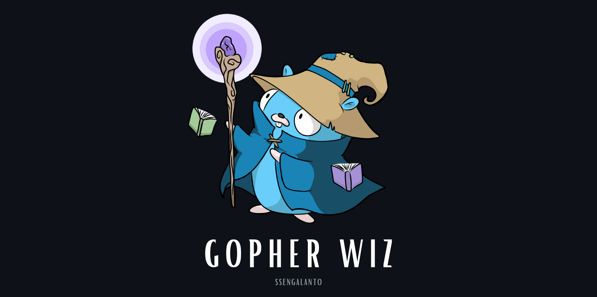

# Midt  [](https://goreportcard.com/report/github.com/ssengalanto/midt) [](https://coveralls.io/github/ssengalanto/midt?branch=main) [](https://pkg.go.dev/github.com/ssengalanto/midt) [](https://opensource.org/licenses/MIT)


`midt` is a simple mediator pattern implementation in Go. It provides a mediator pattern that reduces coupling between program components by making them communicate indirectly through a particular mediator struct.

It supports request/response, commands and queries, notifications and events, and pipeline behaviours.

## Install
`go get -u github.com/ssengalanto/midt`

## Examples
See [examples](https://github.com/ssengalanto/midt/tree/main/_examples/http) for more details.

**Request/Response:**
```go
type CreatePersonRequest struct {
	Email     string `json:"email"`
	FirstName string `json:"firstName"`
	LastName  string `json:"lastName"`
}

type CreatePersonResponse struct {
	ID string `json:"id"`
}

type GetPersonRequest struct {
	ID string `json:"id"`
}

type GetPersonResponse struct {
	ID        string `json:"id"`
	Email     string `json:"email"`
	FirstName string `json:"firstName"`
	LastName  string `json:"lastName"`
}
```

**Command**
```go
type CreatePersonCommand struct {
	Email     string
	FirstName string
	LastName  string
}

func NewCreatePersonCommand(email, fn, ln string) *CreatePersonCommand {
	return &CreatePersonCommand{
		Email:     email,
		FirstName: fn,
		LastName:  ln,
	}
}

```
**Query**
```go
type GetPersonQuery struct {
	ID string
}

func NewGetPersonQuery(id string) *GetPersonQuery {
	return &GetPersonQuery{
		ID: id,
	}
}
```

**Command(Request) Handler**
```go
type CreatePersonCommandHandler struct {
	personRepository memory.Repository
}

func NewCreatePersonCommandHandler(personRepository memory.Repository) *CreatePersonCommandHandler {
	return &CreatePersonCommandHandler{
		personRepository: personRepository,
	}
}

func (c *CreatePersonCommandHandler) Name() string {
	return fmt.Sprintf("%T", &CreatePersonCommand{})
}

func (c *CreatePersonCommandHandler) Handle(ctx context.Context, request any) (any, error) {
	cmd, ok := request.(*CreatePersonCommand)
	if !ok {
		return nil, errors.New("invalid command")
	}

	id, err := c.personRepository.Save(memory.CreatePersonRequest{
		Email:     cmd.Email,
		FirstName: cmd.FirstName,
		LastName:  cmd.LastName,
	})
	if err != nil {
		return nil, errors.New("person creation failed")
	}

	return dto.CreatePersonResponse{ID: id}, nil
}
```

**Query(Request) Handler**
```go
type GetPersonQueryHandler struct {
	personRepository memory.Repository
}

func NewGetPersonQueryHandler(personRepository memory.Repository) *GetPersonQueryHandler {
	return &GetPersonQueryHandler{
		personRepository: personRepository,
	}
}

func (g *GetPersonQueryHandler) Name() string {
	return fmt.Sprintf("%T", &GetPersonQuery{})
}

func (g *GetPersonQueryHandler) Handle(ctx context.Context, request any) (any, error) {
	empty := dto.GetPersonResponse{}

	q, ok := request.(*GetPersonQuery)
	if !ok {
		return empty, errors.New("invalid command")
	}

	pers, err := g.personRepository.FindByID(q.ID)
	if err != nil {
		return empty, errors.New("pers creation failed")
	}

	return dto.GetPersonResponse{
		ID:        pers.ID,
		Email:     pers.Email,
		FirstName: pers.FirstName,
		LastName:  pers.LastName,
	}, nil
}
```

**Event**
```go
type PersonCreatedEvent struct {
	ID        string
	Email     string
	FirstName string
	LastName  string
}

func NewPersonCreatedEvent(id, email, fn, ln string) *PersonCreatedEvent {
	return &PersonCreatedEvent{
		ID:        id,
		Email:     email,
		FirstName: fn,
		LastName:  ln,
	}
}
```

**Event(Notification) Handler**
```go
type PersonCreatedEventHandler struct{}

func NewPersonCreatedEventHandler() *PersonCreatedEventHandler {
	return &PersonCreatedEventHandler{}
}

func (p *PersonCreatedEventHandler) Name() string {
	return fmt.Sprintf("%T", &PersonCreatedEvent{})
}

func (p *PersonCreatedEventHandler) Handle(ctx context.Context, notification any) error {
	evt := notification.(*PersonCreatedEvent)

	log.Printf("person created %+v", evt)

	return nil
}
```

**Pipeline Behaviour**
```go
type LoggerBehaviour struct{}

func NewLoggerBehaviour() *LoggerBehaviour {
	return &LoggerBehaviour{}
}

func (l *LoggerBehaviour) Handle(
	ctx context.Context,
	request any,
	next midt.RequestHandlerFunc,
) (any, error) {
	log.Printf("executing %T", request)

	res, err := next()
	if err != nil {
		return nil, err
	}

	return res, nil
}
```

**Request Handler Registry**
```go
func registerHandlers(repo memory.Repository, m *midt.Midt) {
	createPersonCommandHandler := command.NewCreatePersonCommandHandler(repo)
	err := m.RegisterRequestHandler(createPersonCommandHandler)
	if err != nil {
		log.Fatal(err)
	}

	getPersonQueryHandler := query.NewGetPersonQueryHandler(repo)
	err = m.RegisterRequestHandler(getPersonQueryHandler)
	if err != nil {
		log.Fatal(err)
	}
}
```

**Notification Handler Registry**
```go
func registerNotifications(m *midt.Midt) {
	personCreatedNotificationHandler := event.NewPersonCreatedEventHandler()
	err := m.RegisterNotificationHandler(personCreatedNotificationHandler)
	if err != nil {
		log.Fatal(err)
	}
}
```

**Pipeline Behaviour Registry**
```go
func registerBehaviours(m *midt.Midt) {
	loggerBehaviour := behaviour.NewLoggerBehaviour()
	err := m.RegisterPipelineBehaviour(loggerBehaviour)
	if err != nil {
		log.Fatal(err)
	}
}
```

**Usage (HTTP Handler)**
```go
type CreatePersonHandler struct {
	m *midt.Midt
}

func NewCreatePersonHandler(m *midt.Midt) *CreatePersonHandler {
	return &CreatePersonHandler{m: m}
}

func (c *CreatePersonHandler) Handle(w http.ResponseWriter, r *http.Request) {
	ctx, cancel := context.WithTimeout(context.Background(), constants.RequestTimeout)
	defer cancel()

	if r.Method != http.MethodPost {
		log.Println("invalid http method")
		response.Error(w, http.StatusMethodNotAllowed)
		return
	}

	var req dto.CreatePersonRequest

	err := json.NewDecoder(r.Body).Decode(&req)
	if err != nil {
		log.Println("invalid request body")
		response.Error(w, http.StatusBadRequest)
		return
	}

	// Executing CreatePersonCommand
	cmd := command.NewCreatePersonCommand(req.Email, req.FirstName, req.LastName)
	cmdres, err := c.m.Send(ctx, cmd)
	if err != nil {
		log.Printf("%T execution failed: %+v\n", cmd, err)
		response.Error(w, http.StatusInternalServerError)
		return
	}

	// Executing GetPersonQuery
	id := cmdres.(dto.CreatePersonResponse).ID
	q := query.NewGetPersonQuery(id)
	qres, err := c.m.Send(ctx, q)
	if err != nil {
		log.Printf("%T execution failed: %+v\n", q, err)
		response.Error(w, http.StatusInternalServerError)
		return
	}

	// Executing PersonCreatedEvent
	pers := qres.(dto.GetPersonResponse)
	evt := event.NewPersonCreatedEvent(pers.ID, pers.Email, pers.FirstName, pers.LastName)
	err = c.m.Publish(ctx, evt)
	if err != nil {
		log.Printf("%T execution failed: %+v\n", evt, err)
	}

	response.Success(w, http.StatusCreated, pers)
}
```
